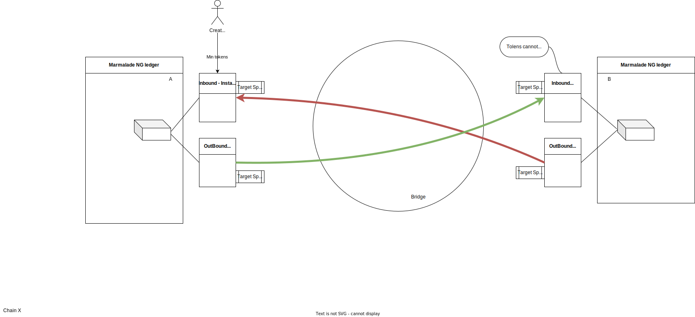

Ledgers adapters
=================

Marmalade NG public ledger
--------------------------

The bridge namespace includes 4 NG policies, to connect with the bridge:
  - The outbound policy
  - 3 flavors of inbound policies (only one must be used)

This allows a lot of combinations to adapt the token's behavior to a lot of use cases.

Outbound policy
^^^^^^^^^^^^^^^
**Important note:** This policy is incompatible with the Marmalade NG's ``DISABLE-BURN`` policy.
Including this policy will disable the possibility of bridging tokens out the ledger. Hopefully, the outbound bridge policy
can efficiently replace the original ``DISABLE-BURN`` policy by using the null target object.

The outbound policy is in charge of calling the ``(ALLOW-BURN   )`` capability of the bridge.

The outbound policy is initialized at token creation time with a guard and an initial target object.
The target object can be modified later by using the function ``set-destination``

Inbound policies
^^^^^^^^^^^^^^^^
**Important note:** These policies are incompatible with the Marmalade NG's ``INSTANT-MINT`` policy, or tokens guarded by a mint-guard in the ``GUARDS`` policy.

The inbound policies are in charge of calling the ``(ALLOW-MINT   )`` capability of the bridge.

The inbound policies are initialized at token creation time with a guard and an initial target object.
The target object can be modified later by using the function ``set-source``

The most simple inbound policy is called :ref:`POLICY-BRIDGE-INBOUND` . This policy does not allow the minting of tokens outside a bridging context.
Sometimes this behavior is expected, but it exhibits an issue: how to initially mint tokens from nothing ?
Moreover ,the inbound policies automatically take precedence over standard minting policies like ``INSTANT-MINT``.

That's why, two extra variations of the basic inbound policy are provided:

- The policy :ref:`POLICY-BRIDGE-INBOUND-INSTANT-MINT` is a mix of the basic inbound policy and ``INSTANT-MINT``. It allows minting tokens by bridging or just after creation.

- The policy :ref:`POLICY-BRIDGE-INBOUND-GUARD-MINT` is a mix of the basic inbound policy and ``GUARD``. It allows minting tokens by signing the transaction with the registered guard.

The module bridge-std-policies
^^^^^^^^^^^^^^^^^^^^^^^^^^^^^^
This module helps to transform:

- a stringified bridge specifications into a list of policies.

- or to transform a list of policies into a bridge specification.

Example of a bridge architecture
^^^^^^^^^^^^^^^^^^^^^^^^^^^^^^^^
Ledger A is the initial minting ledger, while Ledger B is a bridged only ledger.

Marmalade NG private ledgers
----------------------------
The official deployment of the bridge policies is statically linked to the official Marmalade NG.

If someone wants to make them work with a private ledger, he has to deploy other instances of the bridge policies
linked to his ledger.
This can be easily done by following the instructions in the Readme file in the ``deployment`` directory.

Marmalade V1
------------

Helper
^^^^^^
To bridge tokens from a Marmalade V1 ledger, a helper (gateway) module must be used.

Only the direction "Generic -> NG" is supported

The reason is that the poly-fungible-v2 interface standardized in **KIP-0013** doesn't expose the ``burn``
function.

The helper is just a simple module that implements the ``marmalade-burn-helper-v1`` interface to expose the burn function.
A standard helper is provided by the official bridge deployment on chain 8, linked to the official ``marmalade.ledger``

To bridge tokens from a third party Marmalade V1 ledger, a third party helper must be deployed. There is no such difficulty.
Just deploy a copy of the existing module by changing the FQN of the targeted ledger.

Adapt the policy
^^^^^^^^^^^^^^^^

To bridge a token, its policy must be changed to authorize burning and call the bridge's capability ``(ALLOW-BURN-V1)``

Example of an ``enforce-burn`` function of a Marmalade V1 policy, allowing bridging.

.. code-block:: lisp

  (defun enforce-burn:bool
    ( token:object{token-info}
      account:string
      amount:decimal
    )
    (enforce-ledger)
    (require-capability (ALLOW-BURN-V1 marmalade.ledger (at 'id token)
                                       {'ledger:"marmalade-ng-A.ledger", 'token:"", 'chain:""}))
  )

Other ledgers (generic)
-----------------------

The bridge is able to handle tokens from other ledgers not based on Marmalade.
In this case, poly-fungible tokens are not supported: only one owner per token-id. Token id can be any strings (not necessarily ``t:....`` )

Only the direction "Generic -> NG" is supported.

The ledger must implement the interface: ``generic-burnable-nft-v1``:

.. literalinclude:: ../../pact/interfaces/generic-burnable-nft-v1.pact
   :language: lisp

The two following functions must be implemented.

burn
^^^^
*token-id* ``string`` *→* ``bool``

Should burn definitively the token and call somewhere:

.. code-block:: lisp

  (require-capability (ALLOW-BURN-GENERIC generic-ledger token-id
                                          {'ledger:"marmalade-ng-A.ledger", 'token:"", 'chain:""}))

owner-details
^^^^^^^^^^^^^
*token-id* ``string`` *→* ``object{burnable-nft-details}``

This function must return the owner account and the guard of the token.

Because it must be compatible with Marmalade NG, if the owner is a principal account, the guard must match with it.

Outbound considerations
-----------------------

The security of bridge is only granted by the inbound policies and the inbound targets.
As such, outbound targets are not strictly necessary. Even the ``policy-bridge-outbound`` is not strictly necessary.
But using the *outbound targets* properly improves the security of the bridge users by preventing them of losing funds (like mistakenly burning a token),
or getting scammed by phishing ...

For setting-up the outbound targets, we have 3 options:

No outbound target
^^^^^^^^^^^^^^^^^^
- In case of NG ledger: not using the ``policy-output-bridge`` at all.
- In case of V1 or generic ledger: not using ``(require-capability (ALLOW-BURN .....))`` in the ``burn`` or ``enforce-burn`` function.

This is the easiest and the less safe option. It works, but is not recommended. An error of the user could end in a token loss.

Relaxed outbound target
^^^^^^^^^^^^^^^^^^^^^^^
A relaxed outbound target means that the target token is left intentionally blank. Only the field ``ledger`` is set.

This is definitively a safer option than the *No outbound target* one.
It has the advantage of being relatively simple. All similar tokens (same collection / same policy and/or same issuer) can share the same target.

Full outbound target
^^^^^^^^^^^^^^^^^^^^
All fields of the target object are set: ``ledger`` and ``token`` (and eventually ``chain`` in case of X-chain).
This is the best and the recommended option.

The bridgeability of token is completely *locked* from both side of the path. But the creator must set up each token one by one on both sides, increasing the complexity of the token's management.

Moreover, in case of a generic or V1 ledger, an additional registry must be added in the source ledger or the V1 policy.
