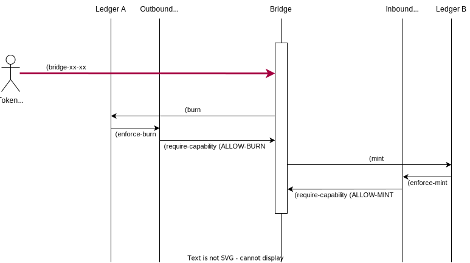

Concepts
========

Bridging procedures
-------------------

#. The tokens must be created on both ledgers, but not necessarily minted

#. The user calls the bridge function, on the bridge component

#. The bridge burns the token on the source ledger

#. The bridge mints the token on the destination ledger

#. Guards are copied and must match.

Target object
-------------
The security and allowance of the system is based on the ``bridge-target`` object.
This object is defined in ``bridge-util.pact``.

.. code-block:: lisp

  (defschema bridge-target
    ledger:string
    token:string
    chain:string
  )

Each endpoint of the bridge must manage a ``bridge-target`` object. This object
is a reference to the opposite endpoint of the bridge.

If the endpoint is outbound:
  - The ``bridge-target`` represents the allowed direction of the token.

If the endpoint id inbound:
  - The ``bridge-target`` represents the source token that allows to mint the considered token.

Requirements
^^^^^^^^^^^^

The target must be setup according to this table:

.. list-table:: brdige-target requirements
  :widths: 50 25 25 25
  :header-rows: 1

  * - /
    - ledger
    - token
    - chain

  * - Outbound (V1, Generic, NG -> NG)
    - FQN *(1)* of the target ledger
    - Targeted token-id ``""`` *(2)*
    - ``""``

  * - Outbound (X-chain)
    - FQN of the current ledger
    - Current token-id or ``""`` *(2)*
    - Destination chain

  * - Inbound (NG <- V1, Generic, NG)
    - FQN of the source ledger
    - Source token-id
    - ``""``

  * - Inbound (X-chain)
    - FQN of the current ledger
    - Current token-id or ``""``
    - Source chain

*(1)* : FQN is the Kadena fully qualified name of the ledger's module: ie: `ns.module`

*(2)* : For an outbound endpoint, specifying the target **token-id** is optional.
This is not a requirement in term of security. But specifying the target **token-id** can help to mitigate
end-user related issues and prevent token loss.

The null target object
^^^^^^^^^^^^^^^^^^^^^^
The null target object is defined in ``bridge-utils`` by:

.. code-block:: json

  {"ledger": "", "token":"", "chain":""}

The null target objects prevent all bridging operations.

Allowances
----------
Each bridge endpoint (policies for Marmalade) must request the bridge by calling
`require-capability` to one of those capabilities:

- ``ALLOW-BURN``
- ``ALLOW-BURN-V1``
- ``ALLOW-BURN-GENERIC``
- ``ALLOW-BURN-MINT``

All those capabilities have the same argument:
  - **current-ledger** : modref of the current ledger. Usually a self reference.
  - **token-id** : string
  - **target** : object{bridge-target}

Summary of modes requirements
-----------------------------

.. list-table:: Modes requirements
  :widths: 50 25 25 25
  :header-rows: 1

  * - /
    - src ledger / dst Ledger
    - src token-id / dst token-id
    - src chain / dst chain

  * - V1 / Generic -> NG
    - NOT ``=``
    - NOT ``=``
    - ``""``

  * - NG -> NG
    - NOT ``=``
    - ``=``
    - ``""``

  * - NG Loopback
    - ``=``
    - NOT ``=``
    - ``""``

  * - NG Cross-chain
    - ``=``
    - ``=``
    - NOT ``=``
